<!-- _class: lead -->
# Metaverso
##   

<!--## Juan Franco-->

# Mi nombre es Juan Franco

 
- Docente
- Universidad Pontificia Bolivariana
- Ingeniería en Diseño de Entretenimiento Digital

# ¿Qué es el `Metaverso`?

# Un acercamiento al concepto

#  

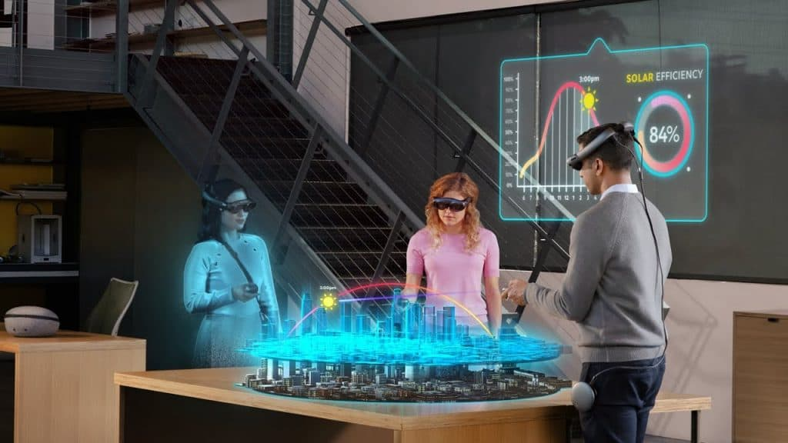

<!-- SPEAKER NOTES
El concepto de metaverse va a combinar la conectividad de la web con la inmersividad de la computación espacial (spatial computing: los computadores tratando de entender el mundo que los rodea) e incluirá crear ambientes y experiencias virtuales, enlazar esos mundos virtuales con el mundo real y permitir interacciones entre múltiples personas
 -->

# ¿Cómo será la educación en Ingeniería en el Metaverso? 

# 
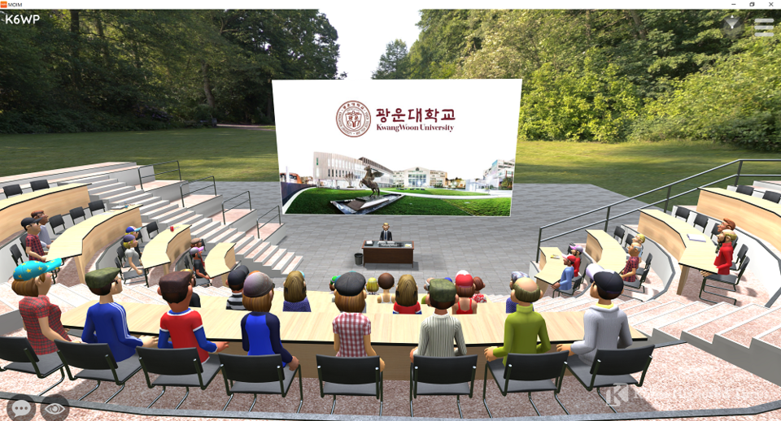

# Algo no me cuadra del todo...

# 

# 

# 
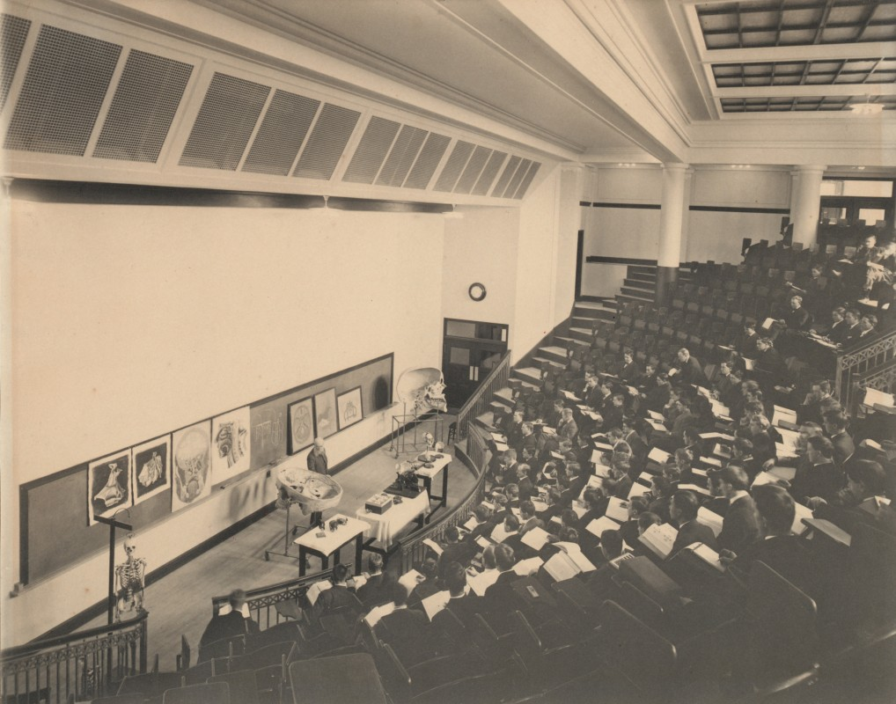

# 
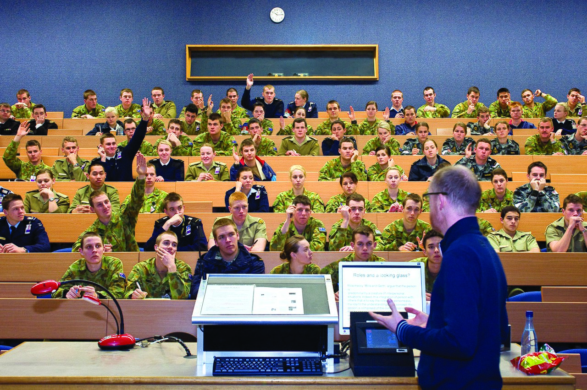

# 

# ¿Notan algún elemento común en estas imágenes?

# CAMBIA EL MEDIO, PERO NO CAMBIA LA FORMA

# ¿Lo podemos hacer diferente?

#

#
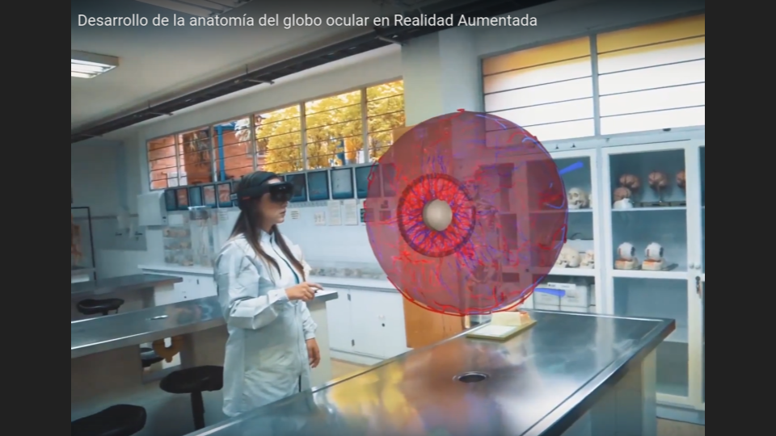

#

#
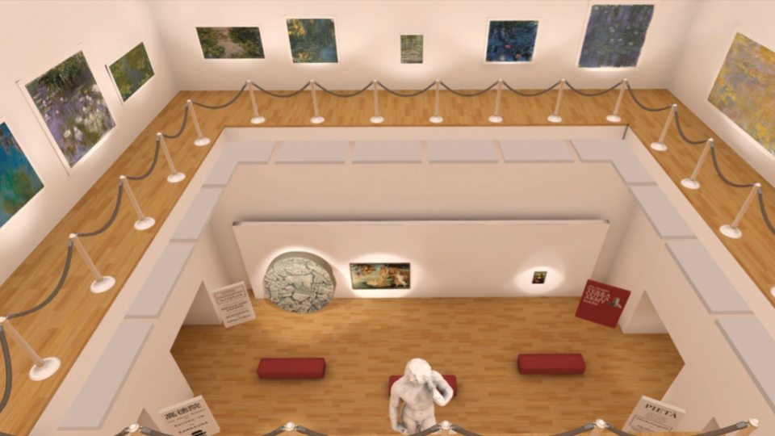

#
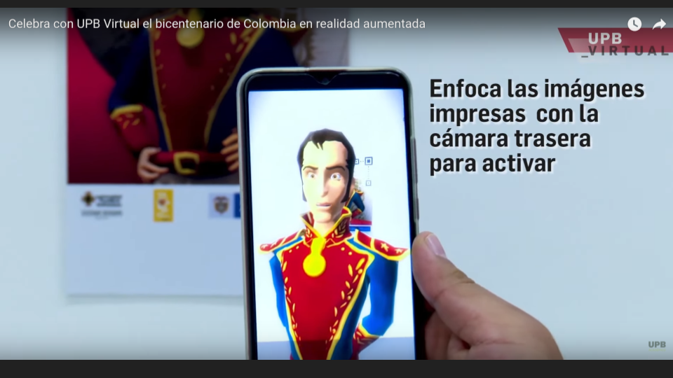

#
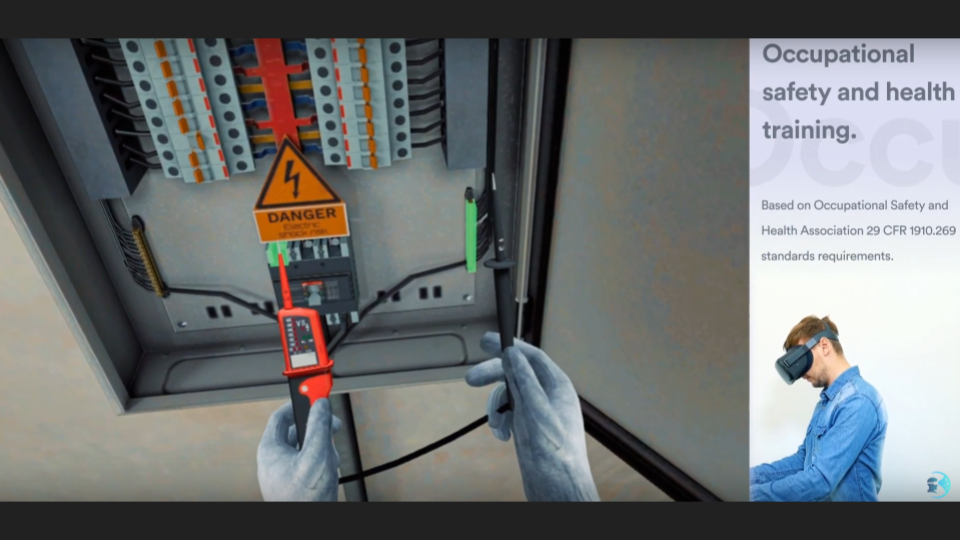

#
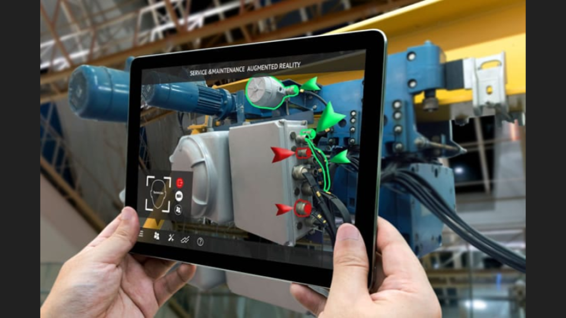

#
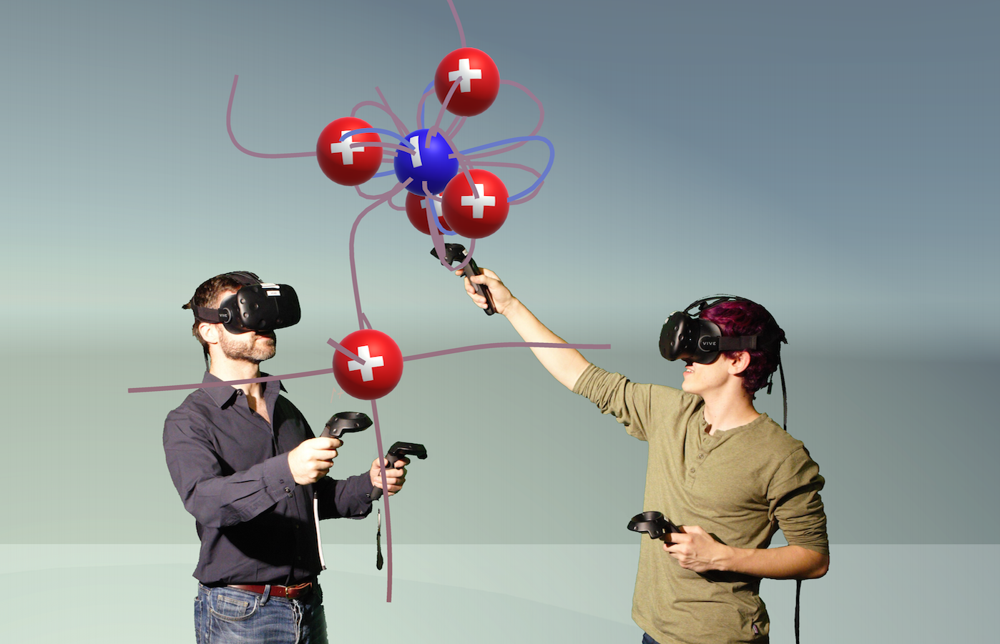

# ¿Cómo será la educación en Ingeniería en el Metaverso?

# Tal vez como una EXPERIENCIA INTERACTIVA

# “The metaverse education is a highly immersive learning space that ensures better engagement and deeper learning and retention”

# ... Tal vez... pero creo que lo anterior se debe DISEÑAR

# ¿Cómo diseñar estas EXPERIENCIAS?

#
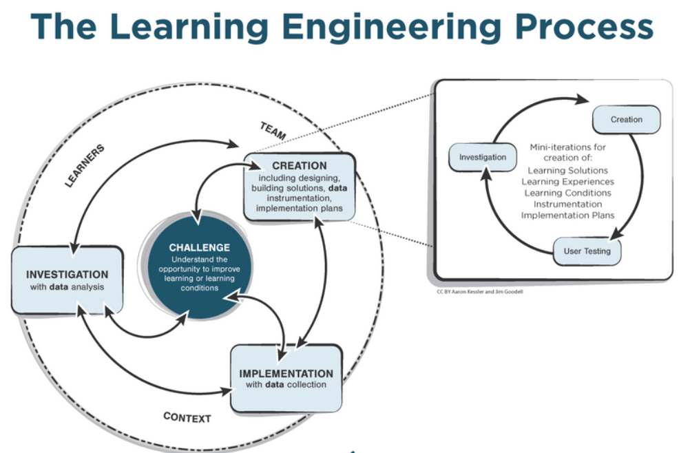

#
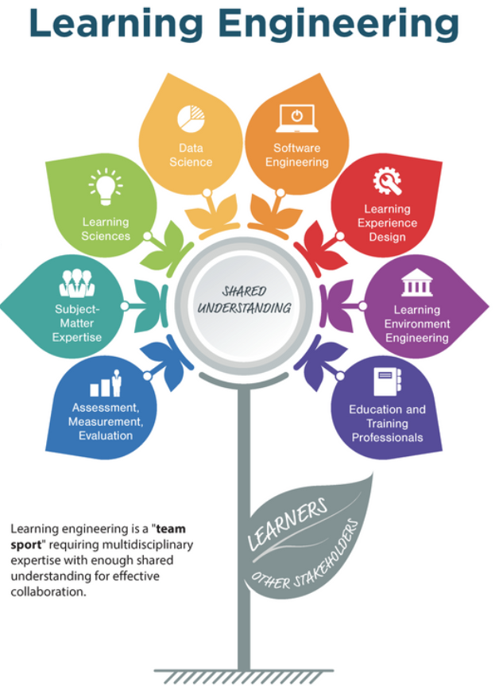

#
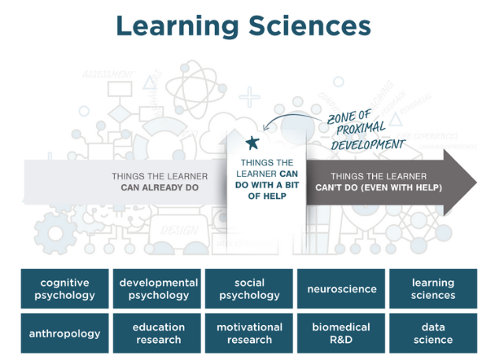

#
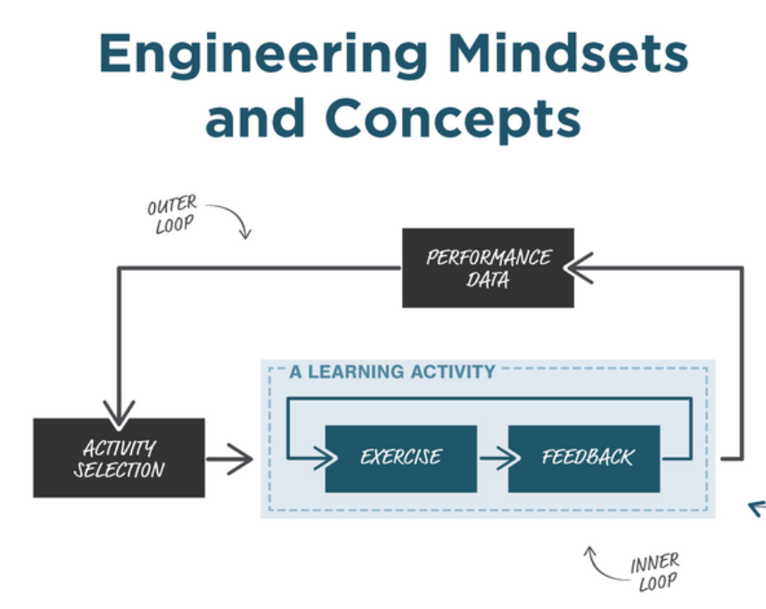

#

#
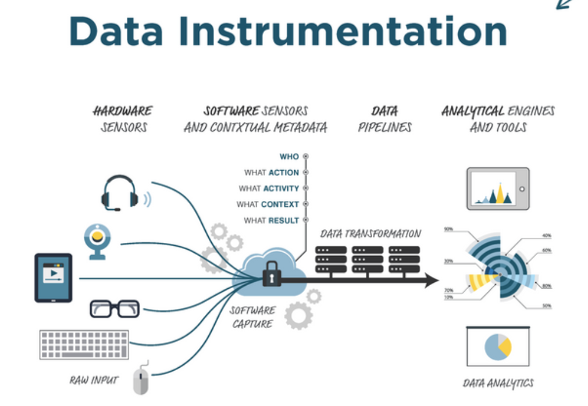

#
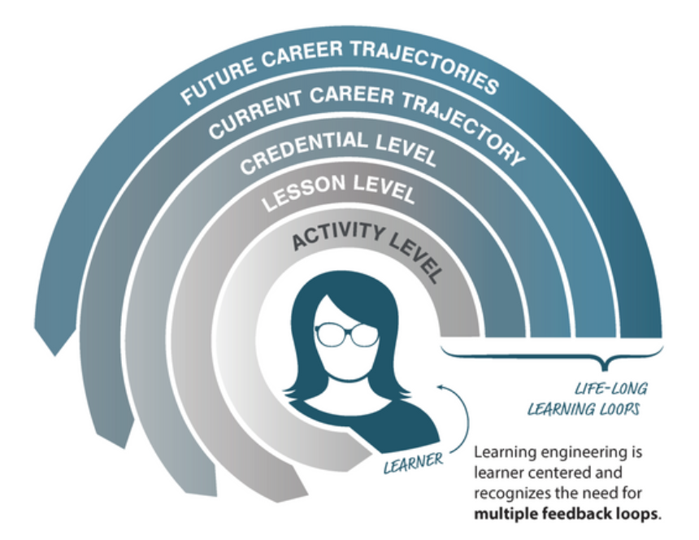

# ¿Cómo será la educación en Ingeniería en el Metaverso?

# Voy en este punto... y seguiré buscando la respuesta

# Y ustedes ¿Cómo DISEÑARÁN la educación en Ingeniería en el Metaverso?
